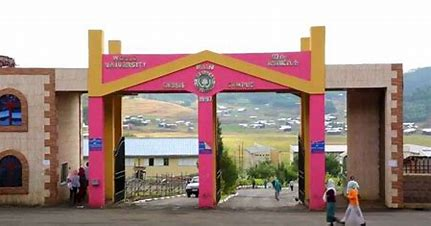
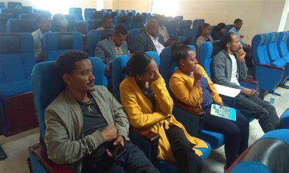

# 🌟 Bruk Alemayehu's Portfolio 🌟  

  

  
 

Welcome to my personal portfolio repository! This is where I showcase my skills, projects, and achievements as a pre-engineering student at **Wollo University, Kombolcha Institute of Technology (Kiot)**. 🚀  

---

## 🌟 About Me  
Hello! I am **Bruk Alemayehu**, a passionate and aspiring engineer with strong programming skills and a commitment to continuous learning. I specialize in developing creative and efficient solutions, leveraging my expertise in various programming languages and tools.  

- 🎓 **Education**: Pre-Engineering at Wollo University, Kiot.  
- 📜 **Certification**: Programming Certificate from Udacity for Ethiopia.  
- 🔧 **Expertise**: Problem-solving, web development, and software design.  

---

## 🛠️ Skills  

| Skill         | Proficiency 🌟 |
|---------------|----------------|
| **Python**    | ★★★★★         |
| **JavaScript**| ★★★★☆         |
| **C++**       | ★★★★★         |
| **HTML/CSS**  | ★★★★☆         |
| **PHP**       | ★★★★☆         |

I am continually improving and excited to learn new technologies to expand my skill set!  

---

## 💻 Projects  

Here are some of the projects I've worked on:

### 🌐 **[Portfolio Website](https://brukalex.github.io/portfolio)**  
A fully responsive and dynamic personal portfolio to showcase my work, skills, and achievements.  

### 🔢 **Calculator App**  
- **Description**: A simple, user-friendly calculator built using JavaScript.  
- **Technologies**: JavaScript, HTML, CSS.  

### 📚 **Library Management System**  
- **Description**: A desktop application to manage books in a library, with borrowing and returning features.  
- **Technologies**: Python, MySQL.  

---

## 📬 Contact Me  

Feel free to reach out for collaborations, discussions, or just to connect!  

- 📧 **Email**: brukalemayehu@example.com  
- 🌐 **GitHub**: [github.com/Brukalex](https://github.com/Brukalex)  
- 💼 **LinkedIn**: [linkedin.com/in/brukalemayehu](#)  

---

## 🎯 Future Goals  

- Enhance my portfolio with advanced projects.  
- Dive deeper into machine learning and AI technologies.  
- Share my learning journey through blogs and tutorials.  

Thank you for visiting my portfolio repository! Stay tuned for updates. 🌟

<!DOCTYPE html>
<html lang="en">
<head>
    <meta charset="UTF-8">
    <meta type="device-width">
    <title>website</title>
    <link rel="stylesheet" href="style.css">
</head>
<body>
    

        
        <h1 class="header">Wollo University</h1>
        
    

    

        <ul>
            <li><a href="index.html">Home</a></li>
            <li><a href="#">Notification</a></li>
            <li><a href="message.html">Message</a></li>
            <li><a href="login.html">Login</a></li>
            <li><a href="about.html">About Developer</a></li>
        </ul>

    

    

        <h1>College</h1>
        
        
WU operates 11 Colleges and 1 Institutes (KombolchaInstitute of Technology (KIoT). HU offers approx 65 undergraduate programs, 0 Masters programs, and 0 PhD programs. In March 2018, the student population was 20,116.

        <h1>Campuses</h1>
        
The University has two campuses, the main campus is located at Dessie and the Kombolcha Campus is located in the City of Kombolcha, some 26 kilometres south-east of the Dessie Campus.

        <h1>Admission Requirements</h1>
        
In general, the Registration for senior and new students of Wollo University started in September. Admission to the Graduate Program: a candidate who has passed Grade 12 Exam successfully may apply for the graduate courses.

    

    

        <h1>Scholarships</h1>
        
        
The University expanded its reach to Afar in 2012 and provided free scholarships to 100 public employees. The scholarship is offered for undergraduate training in the 25th for the regular extension, and for the 25 in the graduate program for the regular 25 for the extension.

        <h1>Courses Offered</h1>
        
The University expanded its reach to Afar in 2012 and provided free scholarships to 100 public employees. The scholarship is offered for undergraduate training in the 25th for the regular extension, and for the 25 in the graduate program for the regular 25 for the extension.

        <h1>Student Grade</h1>
        
The Dessie campus consists of College of Natural Sciences, College of Agriculture, College of Medicine and Health Sciences, College of Business and Economics, College of Social Science and Humanities, School of Veterinary Medicine, School of Law and Institute of Teacher Education and Pedagogical Science. The Kombolcha campus is named as Kombolcha Institute of Technology (KIOT) for engineering and informatics.

            The university has finalized all necessary preconditions to launch two online Journals, namely Abyssinia Journal of Science and Technology (AJST) & Abyssinia Journal of Business and Social Sciences (AJBS).

    

    

        <h1>Student Grade</h1>
        
        
Currently, Wollo University does not have any online student portal. Therefore, all new and old students may check their exam result through offline.

            The student grade system and the examination results can opt from the university campus offices.

    

 

    

        
<strong>Email:</strong>brukalex.11@gmail.com

    

</body>
</html>

